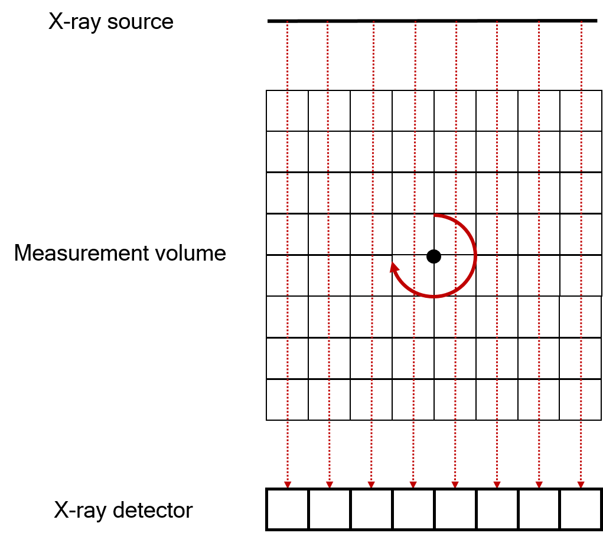
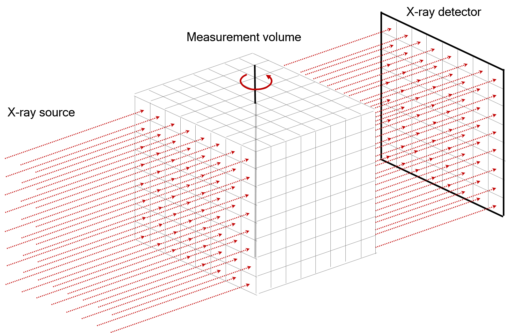
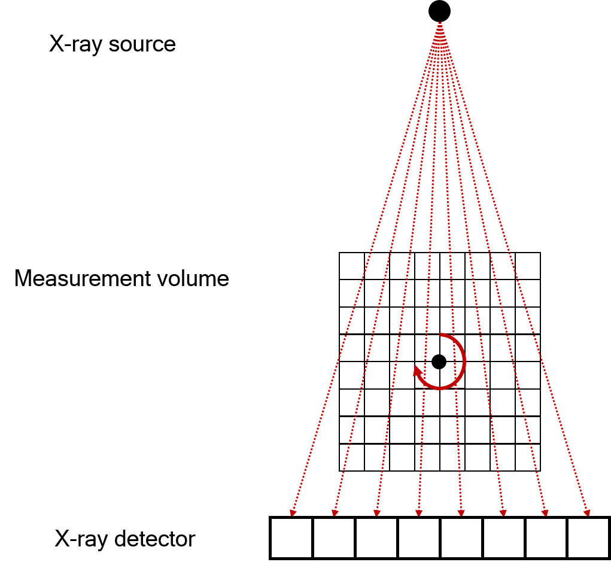
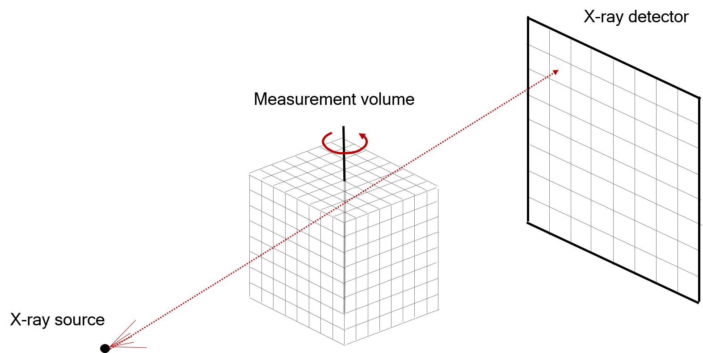
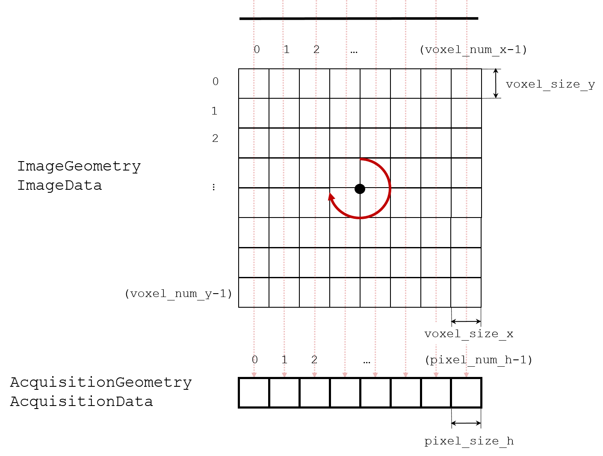
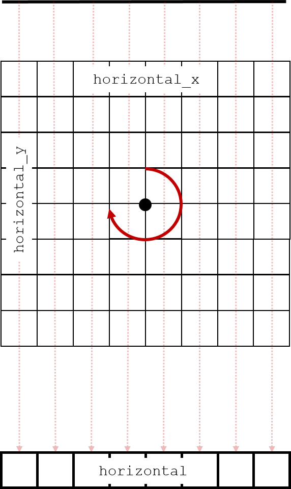
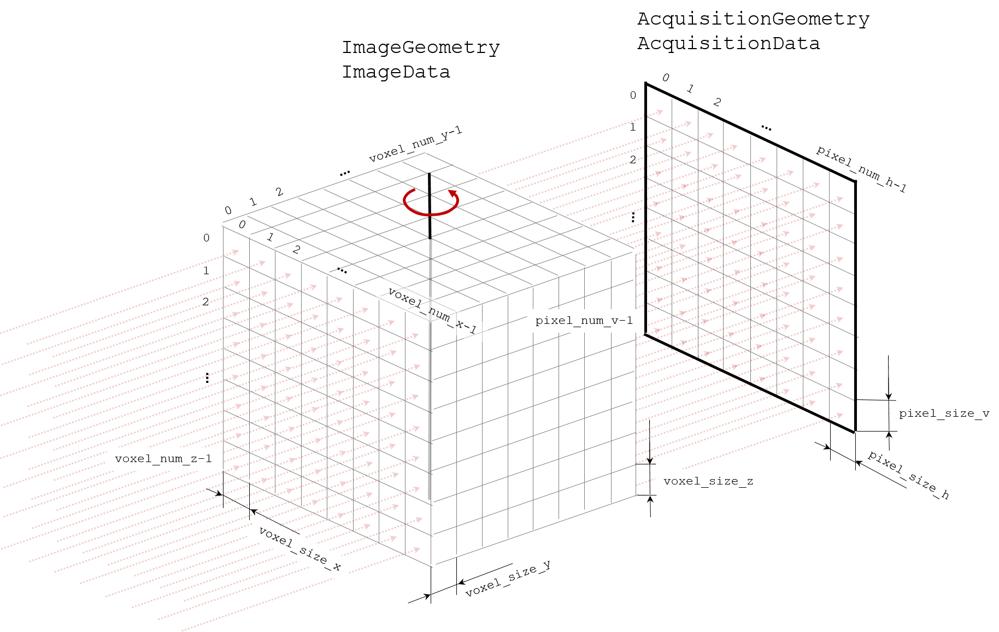
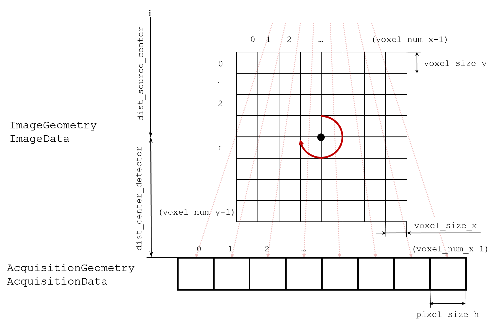
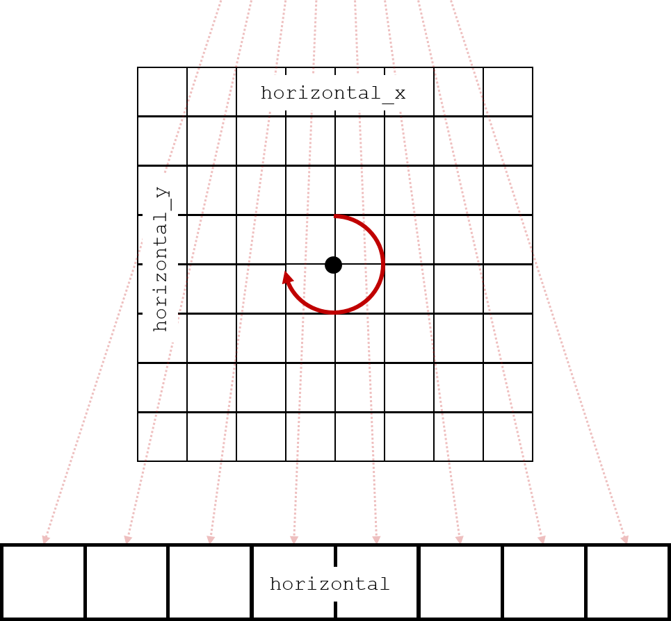

Framework 
*********
The goal of the CCPi Framework is to allow the user to simply create iterative reconstruction methods which
go beyond the standard filter back projection technique and which better suit the data characteristics.
The framework comprises: 

* :code:`ccpi.framework` module which allows to simply translate real world CT systems into software. 
* :code:`ccpi.optimisation` module allows the user to quickly create iterative methods to reconstruct acquisition data applying different types of regularisation, which better suit the data characteristics.
* :code:`ccpi.io` module which provides a number of loaders for real CT machines, e.g. Nikon. It also provides reader and writer to save to NeXuS file format.

CT Geometry
===========

Please refer to `this <https://github.com/vais-ral/CIL-Demos/blob/v19.10.1/Notebooks/00_building_blocks.ipynb>`_ notebook on the CIL-Demos 
repository for full description.

In conventional CT systems, an object is placed between a source emitting X-rays and a detector array 
measuring the X-ray transmission images of the incident X-rays. Typically, either the object is placed 
on a rotating sample stage and rotates with respect to the source-detector assembly, or the 
source-detector gantry rotates with respect to the stationary object. 
This arrangement results in so-called circular scanning trajectory. Depending on source and detector 
types, there are three conventional data acquisition geometries:

* parallel geometry (2D or 3D),
* fan-beam geometry, and
* cone-beam geometry.

Parallel geometry
-----------------

Parallel beams of X-rays are emitted onto 1D (single pixel row) or 2D detector array. This geometry 
is common for synchrotron sources. 2D parrallel geometry is illustrated below.

    2D Parallel geometry

    3D Parallel geometry

Fan-beam geometry
-----------------

A single point-like X-ray source emits a cone beam onto 1D detector pixel row. Cone-beam is typically
 collimated to imaging field of view. Collimation allows greatly reduce amount of scatter radiation 
 reaching the detector. Fan-beam geometry is used when scattering has significant influence on image 
 quality or single-slice reconstruction is sufficient.

    Fan beam geometry

Cone-beam geometry
------------------
A single point-like X-ray source emits a cone beam onto 2D detector array. 
Cone-beam geometry is mainly used in lab-based CT instruments. Depending on where the sample
is placed between the source and the detector one can achieve a different magnification factor :math:`F`:

.. math::
  
  F = \frac{r_1 + r_2}{r_1}

where :math:`r_1` and :math:`r_2` are the distance from the source to the center of the sample and 
the distance from the center of the sample to the detector, respectively.

    Cone beam geometry

AcquisitonGeometry and AcquisitionData
======================================

In the Framework, we implemented :code:`AcquisitionGeometry` class to hold acquisition parameters and 
:code:`ImageGeometry` to hold geometry of a reconstructed volume. Corresponding data arrays are wrapped
as :code:`AcquisitionData` and :code:`ImageData` classes, respectively.

The simplest (of course from image processing point of view, not from physical implementation) geometry 
is the parallel geometry. Geometrical parameters for parallel geometry are depicted below:

    Parallel geometry

In the Framework, we define :code:`AcquisitionGeometry` as follows.

.. code:: python

  # imports
  from ccpi.framework import AcquisitionGeometry
  import numpy as np

  # acquisition angles
  n_angles = 90
  angles = np.linspace(0, np.pi, n_angles, dtype=np.float32)

  # number of pixels in detector row
  N = 256

  # pixel size
  pixel_size_h = 1

  # # create AcquisitionGeometry
  ag_par = AcquisitionGeometry(geom_type='parallel',
                             dimension='2D',
                             angles=angles,
                             pixel_num_h=N,
                             pixel_size_h=pixel_size_h)

:code:`AcquisitionGeometry` contains only metadata, the actual data is wrapped in :code:`AcquisitionData` 
class. :code:`AcquisitionGeometry` class also holds information about arrangement of the actual 
acquisition data array. \
We use attribute :code:`dimension_labels` to label axis. The expected dimension labels are shown below.
The default order of dimensions for :code:`AcquisitionData` is :code:`[angle, horizontal]`, meaning that 
the number of elements along 0 and 1 axes in the acquisition data array is expected to be :code:`n_angles` 
and :code:`N`, respectively.

    Parallel data

To have consistent :code:`AcquisitionData` and :code:`AcquisitionGeometry`, we recommend to allocate
:code:`AcquisitionData` using :code:`allocate` method of the :code:`AcquisitionGeometry` instance:

.. code:: python

  # allocate AcquisitionData
  ad_par = ag_par.allocate()

ImageGeometry and ImageData
===========================

To store reconstruction results, we implemented two classes: :code:`ImageGeometry` and :code:`ImageData` classes.
Similar to :code:`AcquisitionData` and :code:`AcquisitionGeometry`, we first define 2D :code:`ImageGeometry`
and then allocate :code:`ImageData`.

.. code:: python

  # imports
  from ccpi.framework import ImageData, ImageGeometry

  # define 2D ImageGeometry
  # given AcquisitionGeometry ag_par, default parameters for corresponding ImageData
  ig_par = ImageGeometry(voxel_num_y=ag_par.pixel_num_h, 
                       voxel_size_x=ag_par.pixel_size_h,
                       voxel_num_x=ag_par.pixel_num_h,
                       voxel_size_y=ag_par.pixel_size_h)

  # allocate ImageData filled with 0 values with the specific geometry
  im_data1 = ig_par.allocate()
  # allocate ImageData filled with random values with the specific geometry
  im_data2 = ig_par.allocate('random', seed=5)

3D parallel, fan-beam and cone-beam geometries
^^^^^^^^^^^^^^^^^^^^^^^^^^^^^^^^^^^^^^^^^^^^^^

Fan-beam, cone-beam and 3D (multi-slice) parallel geometry can be set-up similar to 2D parallel geometry.

3D parallel geometry
--------------------

    Geometrical parameters and dimension labels for 3D parallel beam geometry

3D parallel beam :code:`AcquisitionGeometry` and default :code:`ImageGeometry` parameters can be set up
as follows:

.. code:: python

  # set-up 3D parallel beam AcquisitionGeometry
  # physical pixel size
  pixel_size_h = 1
  ag_par_3d = AcquisitionGeometry(geom_type='parallel', 
                                dimension='3D', 
                                angles=angles, 
                                pixel_num_h=N, 
                                pixel_size_h=pixel_size_h, 
                                pixel_num_v=N, 
                                pixel_size_v=pixel_size_h)
  # set-up 3D parallel beam ImageGeometry
  ig_par_3d = ImageGeometry(voxel_num_x=ag_par_3d.pixel_num_h,
                          voxel_size_x=ag_par_3d.pixel_size_h,
                          voxel_num_y=ag_par_3d.pixel_num_h,
                          voxel_size_y=ag_par_3d.pixel_size_h,
                          voxel_num_z=ag_par_3d.pixel_num_v,
                          voxel_size_z=ag_par_3d.pixel_size_v)

Fan-beam geometry
-----------------

    Geometrical parameters and dimension labels for fan-beam geometry. 

    Geometrical parameters and dimension labels for fan-beam data. 

Fan-beam :code:`AcquisitionGeometry` and 
default :code:`ImageGeometry` parameters can be set up as follows:

.. code :: python

  # set-up fan-beam AcquisitionGeometry
  # distance from source to center of rotation
  dist_source_center = 200.0
  # distance from center of rotation to detector
  dist_center_detector = 300.0
  # physical pixel size
  pixel_size_h = 2
  ag_fan = AcquisitionGeometry(geom_type='cone', 
                             dimension='2D', 
                             angles=angles, 
                             pixel_num_h=N, 
                             pixel_size_h=pixel_size_h, 
                             dist_source_center=dist_source_center, 
                             dist_center_detector=dist_center_detector)
  # calculate geometrical magnification
  mag = (ag_fan.dist_source_center + ag_fan.dist_center_detector) / ag_fan.dist_source_center

  ig_fan = ImageGeometry(voxel_num_x=ag_fan.pixel_num_h,
                       voxel_size_x=ag_fan.pixel_size_h / mag,
                       voxel_num_y=ag_fan.pixel_num_h,
                       voxel_size_y=ag_fan.pixel_size_h / mag)

.. autoclass:: ccpi.framework.ImageGeometry
   :members:
.. autoclass:: ccpi.framework.AcquisitionGeometry
   :members:
.. autoclass:: ccpi.framework.VectorGeometry
   :members:

=======

``DataContainer`` and subclasses ``AcquisitionData`` and ``ImageData`` are 
meant to contain data and meta-data in ``AcquisitionGeometry`` and 
``ImageGeometry`` respectively.

DataContainer and subclasses
============================

:code:`AcquisiionData` and :code:`ImageData` inherit from the same parent :code:`DataContainer` class, 
therefore they largely behave the same way.

There are algebraic operations defined for both :code:`AcquisitionData` and :code:`ImageData`. 
Following operations are defined:

* binary operations (between two DataContainers or scalar and DataContainer)

  * :code:`+` addition
  * :code:`-` subtraction
  * :code:`/` division
  * :code:`*` multiplication
  * :code:`**` power
  * :code:`maximum`
  * :code:`minimum`

* in-place operations

  * :code:`+=`
  * :code:`-=`
  * :code:`*=`
  * :code:`**=`
  * :code:`/=`

* unary operations

  * :code:`abs`
  * :code:`sqrt`
  * :code:`sign`
  * :code:`conjugate`

* reductions

  * :code:`sum`
  * :code:`norm`
  * :code:`dot` product

:code:`AcquisitionData` and :code:`ImageData` provide a simple method to transpose the data and to 
produce a subset of itself based on the axis we would like to have. This method is based on the label of
the axes of the data rather than the way it is stored. We think that the user should describe what she 
wants and not bother with knowing the actual layout of the data in the memory.

.. code:: python

  # transpose data using subset method
  data_transposed = data.subset(['horizontal_y', 'horizontal_x'])
  # extract single row
  data_profile = data_subset.subset(horizontal_y=100)

.. autoclass:: ccpi.framework.DataContainer
   :members:
   :private-members:
   :special-members:
.. autoclass:: ccpi.framework.ImageData
   :members:
.. autoclass:: ccpi.framework.AcquisitionData
   :members:
.. autoclass:: ccpi.framework.VectorData
   :members:

Multi channel data
------------------

Both :code:`AcquisitionGeometry`, :code:`AcquisitionData` and :code:`ImageGeometry`, :code:`ImageData`
can be defined for multi-channel (spectral) CT data using :code:`channels` attribute.

.. code:: python
  
  # multi-channel fan-beam geometry
  ag_fan_mc = AcquisitionGeometry(geom_type='cone', 
                                 dimension='2D', 
                                 angles=angles, 
                                 pixel_num_h=N, 
                                 pixel_size_h=1, 
                                 dist_source_center=200, 
                                 dist_center_detector=300,
                                 channels=10)

  # define multi-channel 2D ImageGeometry
  ig3 = ImageGeometry(voxel_num_y=5, 
                      voxel_num_x=4, 
                      channels=2)

Block Framework 
===============

The block framework allows writing more advanced `optimisation problems`_. Consider the typical 
`Tikhonov regularisation <https://en.wikipedia.org/wiki/Tikhonov_regularization>`_:

.. math:: 

  \underset{u}{\mathrm{argmin}}\begin{Vmatrix}A u - b \end{Vmatrix}^2_2 + \alpha^2\|Lu\|^2_2

where,

* :math:`A` is the projection operator
* :math:`b` is the acquired data
* :math:`u` is the unknown image to be solved for
* :math:`\alpha` is the regularisation parameter
* :math:`L` is a regularisation operator

The first term measures the fidelity of the solution to the data. The second term meausures the 
fidelity to the prior knowledge we have imposed on the system, operator :math:`L`.  

This can be re-written equivalently in the block matrix form:

.. math::
  \underset{u}{\mathrm{argmin}}\begin{Vmatrix}\binom{A}{\alpha L} u - \binom{b}{0}\end{Vmatrix}^2_2

With the definitions:

* :math:`\tilde{A} = \binom{A}{\alpha L}`
* :math:`\tilde{b} = \binom{b}{0}`

this can now be recognised as a least squares problem which can be solved by any algorithm in the :code:`ccpi.optimisation`
which can solve least squares problem, e.g. CGLS.

.. math:: 

  \underset{u}{\mathrm{argmin}}\begin{Vmatrix}\tilde{A} u - \tilde{b}\end{Vmatrix}^2_2

To be able to express our optimisation problems in the matrix form above, we developed the so-called, 
Block Framework comprising 4 main actors: :code:`BlockGeometry`, :code:`BlockDataContainer`, 
:code:`BlockFunction` and :code:`BlockOperator`.

A :code:`BlockDataContainer` can be instantiated from a number of :code:`DataContainer` and subclasses
represents a column vector of :code:`DataContainer`s.

.. code:: python

  bdc = BlockDataContainer(DataContainer0, DataContainer1)

. These 
classes are required for it to work. They provide a base class that will 
behave as normal ``DataContainer``.

.. autoclass:: ccpi.framework.BlockDataContainer
   :members:
   :private-members:
   :special-members:

.. autoclass:: ccpi.framework.BlockGeometry
   :members:
   :private-members:
   :special-members:

DataProcessor
=============

A :code:`DataProcessor` takes as an input a :code:`DataContainer` or subclass and returns either 
another :code:`DataContainer` or some number. The aim of this class is to simplify the writing of 
processing pipelines.

.. autoclass:: ccpi.framework.DataProcessor
   :members:
   :private-members:
   :special-members:

Resizer
-------

Quite often we need either crop or downsample data; the :code:`Resizer` provides a convenient way to 
perform these operations for both :code:`ImageData` and :code:`AcquisitionData`. 

.. code:: python
  
  # imports
  from ccpi.processors import Resizer
  # crop ImageData along 1st dimension
  # initialise Resizer
  resizer_crop = Resizer(binning = [1, 1], roi = [-1, (20,180)])
  # pass DataContainer
  resizer_crop.input = data
  data_cropped = resizer_crop.process()
  # get new ImageGeometry
  ig_data_cropped = data_cropped.geometry

.. autoclass:: ccpi.processors.Resizer
   :members:
   :private-members:
   :special-members:

Calculation of Center of Rotation
---------------------------------

In the ideal alignment of a CT instrument, orthogonal projection of an axis of rotation onto a 
detector has to coincide with a vertical midline of the detector. This is barely feasible in practice
due to misalignment and/or kinematic errors in positioning of CT instrument components. 
A slight offset of the center of rotation with respect to the theoretical position will contribute 
to the loss of resolution; in more severe cases, it will cause severe artifacts in the reconstructed 
volume (double-borders). :code:`CenterOfRotationFinder` allows to estimate offset of center of rotation 
from theoretical. In the current release :code:`CenterOfRotationFinder` supports only parallel geometry. 

:code:`CenterOfRotationFinder` is based on Nghia Vo's `method <https://doi.org/10.1364/OE.22.019078>`_.

.. autoclass:: ccpi.processors.CenterOfRotationFinder
   :members:
   :private-members:
   :special-members:

:ref:`Return Home <mastertoc>`

.. _optimisation problems: optimisation.html
