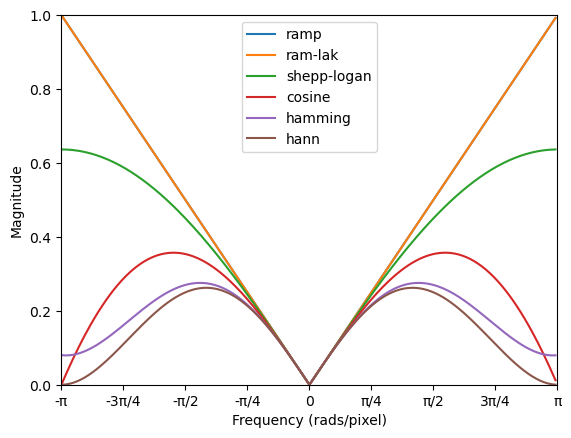

      Copyright 2021 United Kingdom Research and Innovation
      Copyright 2021 The University of Manchester
    
      Licensed under the Apache License, Version 2.0 (the "License");
      you may not use this file except in compliance with the License.
      You may obtain a copy of the License at
    
          http://www.apache.org/licenses/LICENSE-2.0
    
      Unless required by applicable law or agreed to in writing, software
      distributed under the License is distributed on an "AS IS" BASIS,
      WITHOUT WARRANTIES OR CONDITIONS OF ANY KIND, either express or implied.
      See the License for the specific language governing permissions and
      limitations under the License.
    
     Authors:
     CIL Developers, listed at: https://github.com/TomographicImaging/CIL/blob/master/NOTICE.txt
     
Recon
*****

This module allows the user to run pre-configured reconstruction algorithms on their data.

Analytical Reconstruction
=========================

The CIL analytical reconstructions use CIL to filter and prepare the data using highly optimised routines. The filtered data is then
backprojected using projectors from TIGRE or ASTRA-TOOLBOX.

Standard FBP (filtered-backprojection) should be used for parallel-beam data. FDK (Feldkamp, Davis, and Kress) is a filtered-backprojection 
algorithm for reconstruction of cone-beam data measured with a standard circular orbit.

The filter can be set to a predefined function, or a custom filter can be set. The predefined filters take the following forms:

FBP - Reconstructor for parallel-beam geometry
----------------------------------------------

.. autoclass:: cil.recon.FBP
   :members:
   :inherited-members:

FDK - Reconstructor for cone-beam geometry
------------------------------------------

.. autoclass:: cil.recon.FDK
   :members:
   :inherited-members:

:ref:`Return Home <mastertoc>`