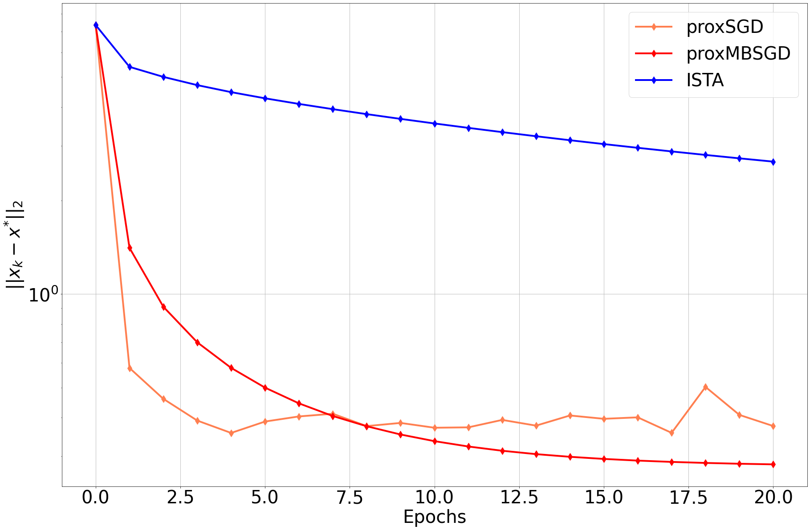
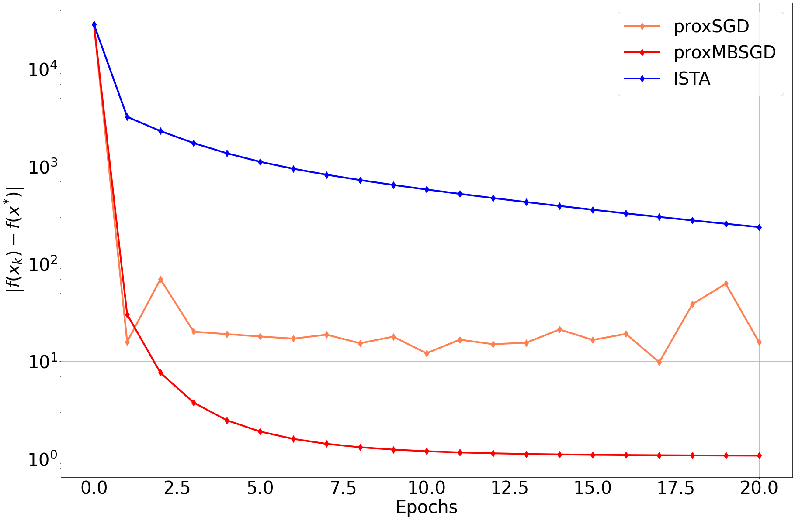
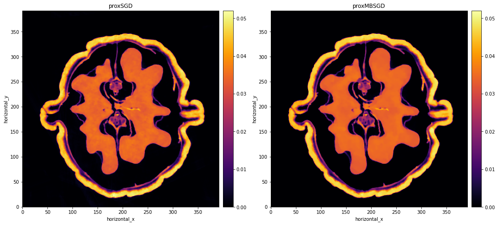
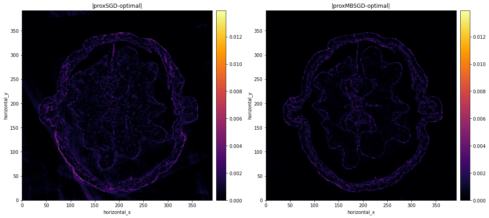

# Stochastic Gradient Descent for Tomography reconstruction

We will use the Stochastic Optimisation framework in CIL to reconstruct real X-ray data  with Total Variation regularisation. We solve the following problem:

$$\min_{u}\quad\frac{1}{2} \|A u - d\|^{2} + \alpha\,\mathrm{TV}(u)$$

### Import Libraries

```python
import os
from cil.io import ZEISSDataReader
from cil.processors import Binner, TransmissionAbsorptionConverter, Slicer
from cil.plugins.astra import ProjectionOperator, FBP
from cil.optimisation.functions import LeastSquares, L2NormSquared
from cil.utilities.display import show2D, show_geometry
from cil.optimisation.algorithms import FISTA, ISTA
from cil.plugins.ccpi_regularisation.functions import FGP_TV
from cil.optimisation.utilities import RandomSampling
from cil.optimisation.functions import SGFunction
import numpy as np

```

We first read our tomographic data. We use the [Walnut Dataset](https://zenodo.org/record/4822516#.Y6Gu_OxBw0p) for this task. 

```python
data_name = "valnut_tomo-A.txrm"
filename = os.path.join(pathname,data_name )

reader = ZEISSDataReader()
reader.set_up(file_name=filename)
data3D = reader.read()
data3D.reorder('astra')
```

The [Walnut Dataset](https://zenodo.org/record/4822516#.Y6Gu_OxBw0p) is a 3D volume. However, for this tutorial, we use only the central slice and select half of the total number of projections.

```python
# Extract vertical slice
data2D = data3D.get_slice(vertical='centre')

# Select every 2 angles
sliced_data = Slicer(roi={'angle':(0,1600,2)})(data2D)

# Reduce background regions
binned_data = Binner(roi={'horizontal':(120,-120,2)})(sliced_data)

# Create absorption data 
data = TransmissionAbsorptionConverter()(binned_data) 

# Remove circular artifacts
data -= np.mean(data.as_array()[80:100,0:30])

# Get Image and Acquisition geometries for one slice
ag2D = data.geometry
ag2D.set_angles(ag2D.angles, initial_angle=0.2, angle_unit='radian')
ig2D = ag2D.get_ImageGeometry()

A = ProjectionOperator(ig2D, ag2D, device = "gpu")

```

The Acquisition and Image Geometries have the following shape:

Acquisition Geometry 2D: (800, 392) with labels ('angle', 'horizontal')

Image Geometry 2D: (392, 392) with labels ('horizontal_y', 'horizontal_x')


We start with an analytic reconstruction:

```python
fbp_recon = FBP(ig2D, ag2D)(data)
show2D(fbp_recon, cmap="inferno", origin="upper", fix_range=(0,0.06))
```

We compute an _optimal_ solution for the above problem using the FISTA algorithm with Total variation regularisation and large number of iterations.

```python
alpha = 0.003 # for walnut
G = (alpha/ig2D.voxel_size_x) * FGP_TV(max_iteration = 100, device="gpu") 
```

```python

initial = ig2D.allocate()
F_FISTA = LeastSquares(A, b = data, c = 0.5)
step_size_ista = 1./F_FISTA.L
fista = FISTA(initial = initial, f=F_FISTA, step_size = step_size_ista, g=G, update_objective_interval = 1000, 
            max_iteration = 1000)
fista.run(verbose=1)
optimal = fista.solution
show2D(fista.solution, cmap="inferno", origin="upper")
```

In our stochastic framework, we replace 

$$\|Au-d\|^{2}$$

by $$\sum_{i=1}^{n}(A_{i}u-d_{i})^{2} = \sum_{i=1}^{n}f_{i}(u)$$, where $n$ is the number of subsets.

```python
num_subsets = 400
```

From a total of 800 projection angles we create 400 subsets of size 2 randomly without replacement.

```python
list_of_batches = RandomSampling(len(data.geometry.angles), batch_size=2, replace=False, seed=10)

def split_acquisition_data(data, selection):
    
    split_data = []
    
    for i in selection.partition_list:
        tmp_geom = data.geometry.copy()
        tmp_geom.config.angles.angle_data = data.geometry.angles[i]
        tmp_data = tmp_geom.allocate(0)
        tmp_data.fill(data.as_array()[i,:])
        split_data.append(tmp_data) 
        
    return split_data

tmp_data = split_acquisition_data(data, list_of_batches)

```

For every subset, we need to form the $f_{i}$ functions which depend on operator $A_{i}$ and the acqusition data $d_{i}$.

```python
f_subsets = []
A_subsets = []

for d in tmp_data:
    
    ageom_subset = d.geometry
    Ai = ProjectionOperator(ig2D, ageom_subset, device = 'gpu') 
    A_subsets.append(Ai)    
    fi = LeastSquares(Ai, b = d, c = 0.5)
    f_subsets.append(fi)  
    
```

In order to measure the distance between the iterate $x^{k}$ and the optimal solution $x^{*}$ we need to override the `update_objective_interval` method for each algorithm.

```python
def update_objective_optimal(self):
    tmp = (self.x - optimal).norm()
    self.loss.append( [self.f(self.x_old) + self.g(self.x_old), tmp] )    
    
ISTA.update_objective =  update_objective_optimal   
```

In the following, we run the following algorithms for 20 epochs:

- ISTA
- SGD
- Mini-Batch SGD

```python
num_epochs = 20
```

### Deterministic ISTA

```python
initial = ig2D.allocate()
F_ISTA = LeastSquares(A, b = data, c = 0.5)
step_size_ista = 1./F_ISTA.L
ista = ISTA(initial = initial, f=F_ISTA, step_size = step_size_ista, g=G, update_objective_interval = 1, 
            max_iteration = num_epochs)
ista.run(verbose=1)
```

### Proximal SGD

```python
initial = ig2D.allocate()
step_size_ista = 0.0003
rs1 = RandomSampling.uniform(len(f_subsets)) 
F1 = SGFunction(f_subsets, selection=rs1)
proxSGD1 = ISTA(initial = initial, f=F1, step_size = step_size_ista, g=G, 
            update_objective_interval = n_subsets, 
            max_iteration = n_epochs*n_subsets)
proxSGD1.run(verbose=1)
```
### Proximal Mini-Batch SGD

```python

rs2 = RandomSampling.uniform(len(f_subsets), batch_size=5) 

F2 = SGFunction(f_subsets, selection=rs2)
step_size_ista = 0.0003
proxSGD2 = ISTA(initial = initial, f=F2, step_size = step_size_ista, g=G, 
            update_objective_interval = rs2.num_batches, 
            max_iteration = num_epochs*rs2.num_batches)
proxSGD2.run(verbose=1)

```










