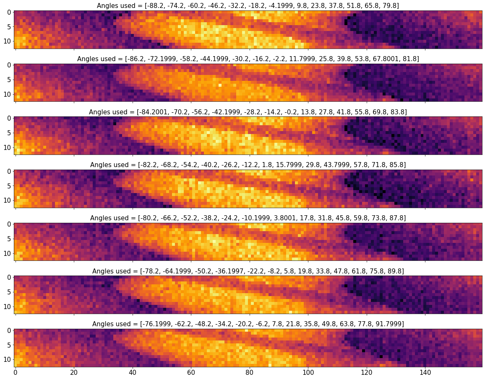
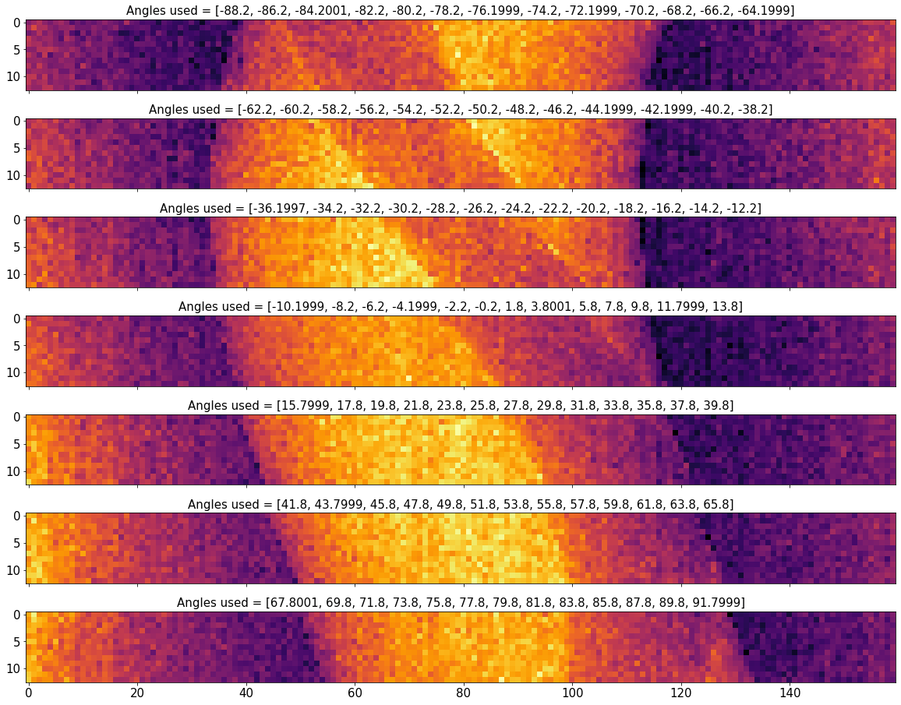

```python
import os
from cil.processors import Binner, TransmissionAbsorptionConverter, Slicer, CentreOfRotationCorrector
from cil.optimisation.utilities import RandomSampling, SequentialSampling
from cil.utilities import dataexample

import numpy as np
import matplotlib.pyplot as plt
from mpl_toolkits.axes_grid1 import AxesGrid
from mpl_toolkits.axes_grid1.anchored_artists import AnchoredSizeBar
```

### Read SYNCHROTRON_PARALLEL_BEAM_DATA 


```python
data = dataexample.SYNCHROTRON_PARALLEL_BEAM_DATA.get()
data_raw20 = data.get_slice(vertical=20)
scale = data_raw20.sum()/data_raw20.size
data /= scale
data.log(out=data)
data *= -1
data = CentreOfRotationCorrector.xcorrelation(slice_index='centre')(data)
data.reorder('astra')
```


```python
print("Acquisition Data shape", data.shape)
print("Acquisition Data geometry labels", data.geometry.dimension_labels)
```

    Acquisition Data shape (135, 91, 160)
    Acquisition Data geometry labels ('vertical', 'angle', 'horizontal')


### How to use acquisition data splitting

1) `data_split =  data.split_to_subsets(num_subsets, method="ordered")`
2) `data_split =  data.split_to_subsets(num_subsets, method="random")`
3) `data_split, method =  data.split_to_subsets(num_subsets, method=" ordered", info=True)`


4) `method = SequentialSampling.ordered(number_angles, num_subsets)`

   `data_split =  data.split_to_subsets(method=method)`


### Number of projection angles = 91, divisors =1, 7, 13, and 91

By default a `step_size = num_batches` is used.


```python
num_subsets = 7

# default
# data_split = data.split_to_subsets(num_subsets, method="ordered")

# return method info
data_split, method = data.split_to_subsets(num_subsets, method = "ordered", info=True)

print("Number of subsets = {}".format(method.num_batches))

for i,k in enumerate(method.partition_list):
    print("Subset {} : {}\n".format(i,k))

for i,k in enumerate(data_split):
    print("Subset {} : Angles used = {}\n".format(i,list(k.geometry.angles)))
    
    
slice_ind = 50

plt.rcParams['xtick.labelsize']=15
plt.rcParams['ytick.labelsize']=15

fig = plt.figure(figsize=(20, 20)) 
grid = AxesGrid(fig, 111,
                nrows_ncols=(method.num_batches, 1),
                axes_pad=0.5
                )
k = 0
for ax in grid:    
    ax.imshow(data_split[k].array[slice_ind], cmap="inferno")
    ax.set_title("Angles used = {}".format(list(data_split[k].geometry.angles)),fontsize=15)    
    k+=1    
plt.show()
    
```

    WARNING:root:Batch size is (constant) self.num_indices//self.num_batches 


    Number of subsets = 7
    Subset 0 : [0, 7, 14, 21, 28, 35, 42, 49, 56, 63, 70, 77, 84]
    
    Subset 1 : [1, 8, 15, 22, 29, 36, 43, 50, 57, 64, 71, 78, 85]
    
    Subset 2 : [2, 9, 16, 23, 30, 37, 44, 51, 58, 65, 72, 79, 86]
    
    Subset 3 : [3, 10, 17, 24, 31, 38, 45, 52, 59, 66, 73, 80, 87]
    
    Subset 4 : [4, 11, 18, 25, 32, 39, 46, 53, 60, 67, 74, 81, 88]
    
    Subset 5 : [5, 12, 19, 26, 33, 40, 47, 54, 61, 68, 75, 82, 89]
    
    Subset 6 : [6, 13, 20, 27, 34, 41, 48, 55, 62, 69, 76, 83, 90]
    
    Subset 0 : Angles used = [-88.2, -74.2, -60.2, -46.2, -32.2, -18.2, -4.1999, 9.8, 23.8, 37.8, 51.8, 65.8, 79.8]
    
    Subset 1 : Angles used = [-86.2, -72.1999, -58.2, -44.1999, -30.2, -16.2, -2.2, 11.7999, 25.8, 39.8, 53.8, 67.8001, 81.8]
    
    Subset 2 : Angles used = [-84.2001, -70.2, -56.2, -42.1999, -28.2, -14.2, -0.2, 13.8, 27.8, 41.8, 55.8, 69.8, 83.8]
    
    Subset 3 : Angles used = [-82.2, -68.2, -54.2, -40.2, -26.2, -12.2, 1.8, 15.7999, 29.8, 43.7999, 57.8, 71.8, 85.8]
    
    Subset 4 : Angles used = [-80.2, -66.2, -52.2, -38.2, -24.2, -10.1999, 3.8001, 17.8, 31.8, 45.8, 59.8, 73.8, 87.8]
    
    Subset 5 : Angles used = [-78.2, -64.1999, -50.2, -36.1997, -22.2, -8.2, 5.8, 19.8, 33.8, 47.8, 61.8, 75.8, 89.8]
    
    Subset 6 : Angles used = [-76.1999, -62.2, -48.2, -34.2, -20.2, -6.2, 7.8, 21.8, 35.8, 49.8, 63.8, 77.8, 91.7999]
    





### Number of projection angles = 91, divisors =1, 7, 13, and 91

`step_size = 1` is used.


```python
num_batches = 7

method = SequentialSampling.ordered(91, num_batches, step_size=1)
data_split = data.split_to_subsets(method = method)


print("Number of subsets = {}".format(method.num_batches))

for i,k in enumerate(method.partition_list):
    print("Subset {} : {}\n".format(i,k))

for i,k in enumerate(data_split):
    print("Subset {} : Angles used = {}\n".format(i,list(k.geometry.angles)))
    
    
slice_ind = 50

plt.rcParams['xtick.labelsize']=15
plt.rcParams['ytick.labelsize']=15

fig = plt.figure(figsize=(20, 20)) 
grid = AxesGrid(fig, 111,
                nrows_ncols=(method.num_batches, 1),
                axes_pad=0.5
                )
k = 0
for ax in grid:    
    ax.imshow(data_split[k].array[slice_ind], cmap="inferno")
    ax.set_title("Angles used = {}".format(list(data_split[k].geometry.angles)),fontsize=15)    
    k+=1    
plt.show()
    
```

    WARNING:root:Batch size is (constant) self.num_indices//self.num_batches 


    Number of subsets = 7
    Subset 0 : [0, 1, 2, 3, 4, 5, 6, 7, 8, 9, 10, 11, 12]
    
    Subset 1 : [13, 14, 15, 16, 17, 18, 19, 20, 21, 22, 23, 24, 25]
    
    Subset 2 : [26, 27, 28, 29, 30, 31, 32, 33, 34, 35, 36, 37, 38]
    
    Subset 3 : [39, 40, 41, 42, 43, 44, 45, 46, 47, 48, 49, 50, 51]
    
    Subset 4 : [52, 53, 54, 55, 56, 57, 58, 59, 60, 61, 62, 63, 64]
    
    Subset 5 : [65, 66, 67, 68, 69, 70, 71, 72, 73, 74, 75, 76, 77]
    
    Subset 6 : [78, 79, 80, 81, 82, 83, 84, 85, 86, 87, 88, 89, 90]
    
    Subset 0 : Angles used = [-88.2, -86.2, -84.2001, -82.2, -80.2, -78.2, -76.1999, -74.2, -72.1999, -70.2, -68.2, -66.2, -64.1999]
    
    Subset 1 : Angles used = [-62.2, -60.2, -58.2, -56.2, -54.2, -52.2, -50.2, -48.2, -46.2, -44.1999, -42.1999, -40.2, -38.2]
    
    Subset 2 : Angles used = [-36.1997, -34.2, -32.2, -30.2, -28.2, -26.2, -24.2, -22.2, -20.2, -18.2, -16.2, -14.2, -12.2]
    
    Subset 3 : Angles used = [-10.1999, -8.2, -6.2, -4.1999, -2.2, -0.2, 1.8, 3.8001, 5.8, 7.8, 9.8, 11.7999, 13.8]
    
    Subset 4 : Angles used = [15.7999, 17.8, 19.8, 21.8, 23.8, 25.8, 27.8, 29.8, 31.8, 33.8, 35.8, 37.8, 39.8]
    
    Subset 5 : Angles used = [41.8, 43.7999, 45.8, 47.8, 49.8, 51.8, 53.8, 55.8, 57.8, 59.8, 61.8, 63.8, 65.8]
    
    Subset 6 : Angles used = [67.8001, 69.8, 71.8, 73.8, 75.8, 77.8, 79.8, 81.8, 83.8, 85.8, 87.8, 89.8, 91.7999]
    




