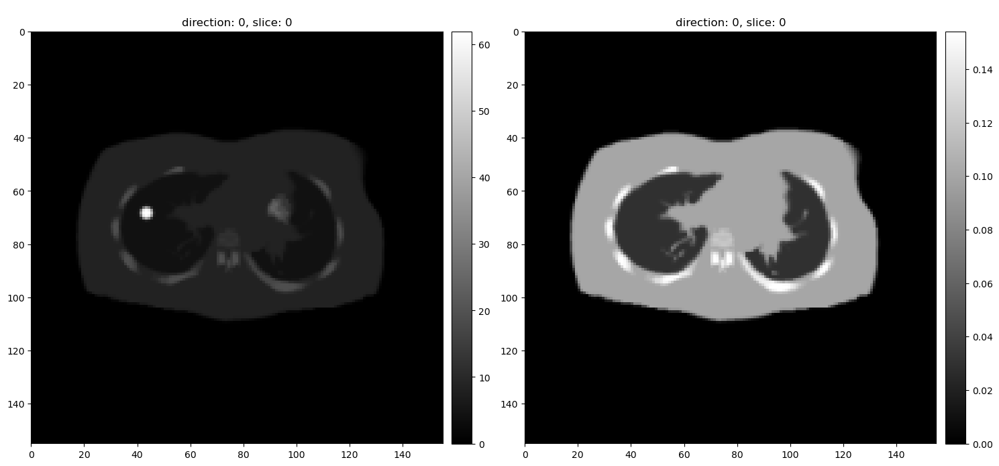
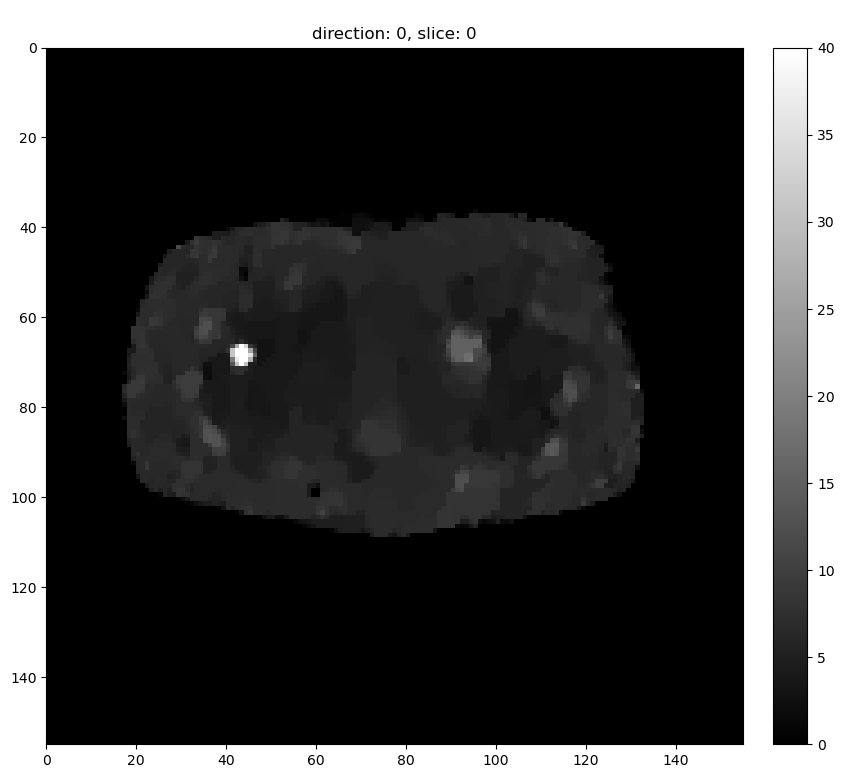
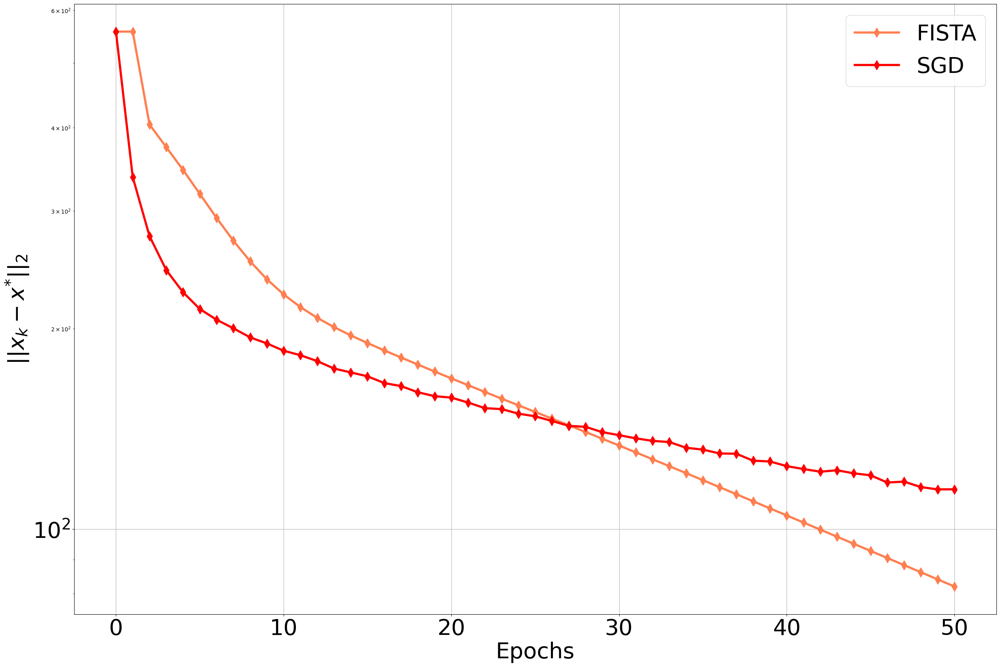
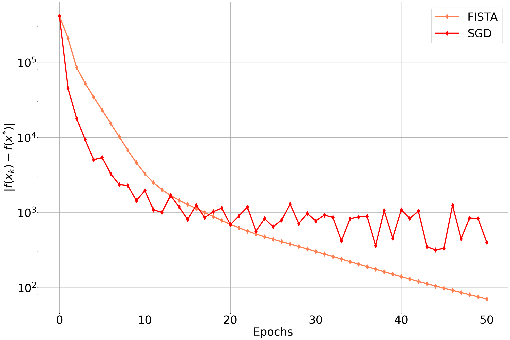
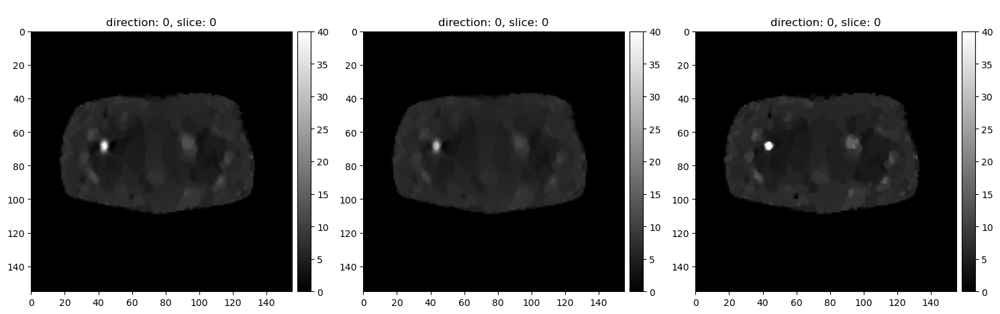
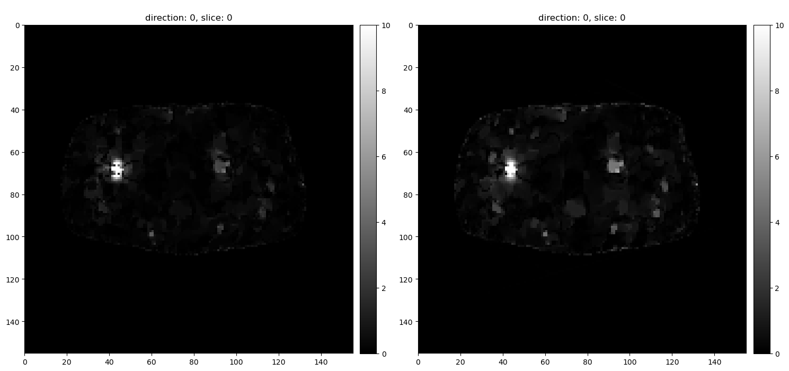

```python
#%% Initial imports etc
import numpy
import matplotlib.pyplot as plt

import os
import sys
import shutil
import sirf

import sirf.STIR as pet
from sirf.Utilities import examples_data_path

# turn off verbosity
pet.set_verbosity(0)
pet.AcquisitionData.set_storage_scheme("memory")
msg = sirf.STIR.MessageRedirector(info=None, warn=None, errr=None)

# cil imports
from cil.plugins.ccpi_regularisation.functions import FGP_TV    
from cil.optimisation.functions import KullbackLeibler, IndicatorBox, OperatorCompositionFunction, L2NormSquared, BlockFunction, TotalVariation
from cil.optimisation.operators import BlockOperator
from cil.optimisation.algorithms import SPDHG, PDHG, FISTA   
from cil.utilities.display import show2D


from cil.optimisation.utilities import RandomSampling, SequentialSampling

from cil.optimisation.functions import LeastSquares, SGFunction, KullbackLeibler
from cil.optimisation.algorithms import FISTA, ISTA
from cil.plugins.ccpi_regularisation.functions import FGP_TV
from cil.optimisation.utilities import OptimalityDistance


import numpy as np
import matplotlib.pyplot as plt

```


```python
# define the directory with input files for this notebook
data_path = os.path.join(examples_data_path('PET'), 'thorax_single_slice')
```


```python
#%% Read in images
image = pet.ImageData(os.path.join(data_path, 'emission.hv'))
attn_image = pet.ImageData(os.path.join(data_path, 'attenuation.hv'))
template = pet.AcquisitionData(os.path.join(data_path, 'template_sinogram.hs'))
```

    
    WARNING: RadioNuclideDB::get_radionuclide: unknown modality. Returning "unknown" radionuclide.


```python
show2D([image, attn_image], cmap="gray", origin="upper")
```





    <cil.utilities.display.show2D at 0x7f1b8f8035b0>


```python
# create attenuation
acq_model_for_attn = pet.AcquisitionModelUsingRayTracingMatrix()
asm_attn = pet.AcquisitionSensitivityModel(attn_image, acq_model_for_attn)
asm_attn.set_up(template)
attn_factors = asm_attn.forward(template.get_uniform_copy(1))
asm_attn = pet.AcquisitionSensitivityModel(attn_factors)

# create acquisition model
acq_model = pet.AcquisitionModelUsingRayTracingMatrix()
# we will increase the number of rays used for every Line-of-Response (LOR) as an example
# (it is not required for the exercise of course)
acq_model.set_num_tangential_LORs(10)
acq_model.set_acquisition_sensitivity(asm_attn)
# set-up
acq_model.set_up(template,image)
```


```python
# simulate some data using forward projection
acquired_data = acq_model.forward(image)

# add poisson
noisy_array=numpy.random.poisson(acquired_data.as_array()).astype('float64')
noisy_data = acquired_data.clone()
noisy_data.fill(noisy_array);

background_term = acquired_data.get_uniform_copy(acquired_data.max()/10)

```


```python
# problem with "check input method" `geometry` attribute does not exist in SIRF
def new_check_input(self, input):
    pass

FGP_TV.check_input = new_check_input

# Solve with FISTA
initial = image.get_uniform_copy(0)

alpha = 0.1
F = KullbackLeibler(b=noisy_data, eta = background_term, backend="numba") 
# use numba = False does not work

F.L = 0.005
G = alpha * FGP_TV(device="gpu") #IndicatorBox(lower=0)
F_fista = OperatorCompositionFunction(F, acq_model)

fista = FISTA(initial = initial, f = F_fista, g=G, update_objective_interval=50,
                            max_iteration=200)
fista.run(verbose=1)
```

         Iter   Max Iter     Time/Iter            Objective
                                   [s]                     
            0        200         0.000          5.13346e+05
           50        200         0.465          1.01127e+05
          100        200         0.455          1.01062e+05
          150        200         0.451          1.01058e+05
          200        200         0.448          1.01057e+05
    -------------------------------------------------------
          200        200         0.448          1.01057e+05
    Stop criterion has been reached.
    


```python
show2D(fista.solution, cmap="gray", origin="upper", fix_range=(0,40))
```





    <cil.utilities.display.show2D at 0x7f1a09ad90f0>


```python
def split_acquisition_data(data, selection):
    
    data_split = []
    
    for i in selection.partition_list:
        data_subset = data.get_subset(i)
        data_split.append(data_subset)
        
    return data_split

method = SequentialSampling(64, 32)

data_split = split_acquisition_data(noisy_data, method)
data_background_split = split_acquisition_data(background_term, method)
attn_factors_split = split_acquisition_data(attn_factors, method)


```

    WARNING:root:Batch size is (constant) self.num_indices//self.num_batches 


```python
def list_of_functions(data, data_background, attn_factors,  image):
    
    list_funcs = []
    for i in range(len(data)):

        fi = KullbackLeibler(b=data[i], eta = data_background[i], backend="numba") 
        # confirm next lines with Kris/Evgueni
        acq_model = pet.AcquisitionModelUsingRayTracingMatrix()
        acq_model.set_num_tangential_LORs(10)
        asm_attn = pet.AcquisitionSensitivityModel(attn_factors[i]) 
        acq_model.set_acquisition_sensitivity(asm_attn)
        acq_model.set_up(data[i],image)                      
        list_funcs.append(OperatorCompositionFunction(fi, acq_model))

    return list_funcs

list_func = list_of_functions(data_split, data_background_split, attn_factors_split, image)
```


```python
num_subsets = 32
selection = RandomSampling.uniform(len(list_func), num_subsets, seed=41) # shuffle=True
sg_func = SGFunction(list_func, selection=selection)
```

    WARNING:root:Batch size is (constant) self.num_indices//self.num_batches 


```python
num_epochs = 50
step_size_ista = 0.01
sgd = ISTA(initial = initial, f = sg_func, step_size = step_size_ista, g=G, 
            update_objective_interval = selection.num_batches, 
            max_iteration = num_epochs * selection.num_batches)  
ci = OptimalityDistance(sgd, fista.solution)
sgd.run(verbose=1, callback=ci)
```

         Iter   Max Iter     Time/Iter            Objective
                                   [s]                     
            0       1600         0.000          5.13346e+05
           32       1600         0.328          1.46406e+05
           64       1600         0.327          1.19011e+05
           96       1600         0.328          1.10381e+05
          128       1600         0.331          1.06084e+05
          160       1600         0.332          1.06419e+05
          192       1600         0.332          1.04322e+05
          224       1600         0.333          1.03397e+05
          256       1600         0.331          1.03336e+05
          288       1600         0.331          1.02494e+05
          320       1600         0.331          1.03011e+05
          352       1600         0.331          1.02135e+05
          384       1600         0.331          1.02056e+05
          416       1600         0.331          1.02736e+05
          448       1600         0.331          1.02237e+05
          480       1600         0.330          1.01859e+05
          512       1600         0.330          1.02301e+05
          544       1600         0.329          1.01909e+05
          576       1600         0.329          1.02077e+05
          608       1600         0.330          1.02193e+05
          640       1600         0.330          1.01742e+05
          672       1600         0.330          1.01954e+05
          704       1600         0.330          1.02229e+05
          736       1600         0.330          1.01616e+05
          768       1600         0.330          1.01881e+05
          800       1600         0.330          1.01700e+05
          832       1600         0.329          1.01846e+05
          864       1600         0.329          1.02345e+05
          896       1600         0.329          1.01765e+05
          928       1600         0.329          1.02023e+05
          960       1600         0.329          1.01825e+05
          992       1600         0.329          1.01977e+05
         1024       1600         0.329          1.01915e+05
         1056       1600         0.329          1.01474e+05
         1088       1600         0.329          1.01879e+05
         1120       1600         0.329          1.01927e+05
         1152       1600         0.329          1.01946e+05
         1184       1600         0.329          1.01418e+05
         1216       1600         0.329          1.02109e+05
         1248       1600         0.329          1.01510e+05
         1280       1600         0.329          1.02135e+05
         1312       1600         0.330          1.01886e+05
         1344       1600         0.330          1.02095e+05
         1376       1600         0.329          1.01405e+05
         1408       1600         0.329          1.01373e+05
         1440       1600         0.329          1.01388e+05
         1472       1600         0.329          1.02295e+05
         1504       1600         0.329          1.01500e+05
         1536       1600         0.329          1.01898e+05
         1568       1600         0.329          1.01883e+05
         1600       1600         0.329          1.01457e+05
    -------------------------------------------------------
         1600       1600         0.329          1.01457e+05
    Stop criterion has been reached.
    


```python
fista1 = FISTA(initial = initial, f = F_fista, g=G, update_objective_interval=1,
                            max_iteration=50)
ci = OptimalityDistance(fista1, fista.solution)
fista1.run(verbose=0, callback=ci)
```


```python
import matplotlib.pyplot as plt
import matplotlib as mpl
mpl.rcParams['lines.linewidth'] = 4
mpl.rcParams['lines.markersize'] = 12

plt.figure(figsize=(30,20))
plt.semilogy([l for l in fista1.optimality_distance], label="FISTA", color="coral", marker="d")
plt.semilogy([l for l in sgd.optimality_distance], label="SGD", color="red", marker="d")
plt.ylabel("$||x_{k} - x^{*}||_{2}$",fontsize=40)
plt.xlabel("Epochs", fontsize=40)
plt.tick_params(axis='x',  labelsize=40)
plt.tick_params(axis='y',  labelsize=40)
plt.legend(loc='upper right', prop={'size': 40})
plt.grid()
plt.show()

plt.figure(figsize=(30,20))
plt.semilogy([np.abs(l-fista.objective[-1]) for l in fista1.objective], label="FISTA", color="coral", marker="d")
plt.semilogy([np.abs(l-fista.objective[-1]) for l in sgd.objective], label="SGD", color="red", marker="d")
plt.ylabel("$|f(x_{k}) - f(x^{*})|$",fontsize=40)
plt.xlabel("Epochs", fontsize=40)
plt.tick_params(axis='x',  labelsize=40)
plt.tick_params(axis='y',  labelsize=40)
plt.legend(loc='upper right', prop={'size': 40})
plt.grid()
plt.show()
```








```python
show2D([fista1.solution.as_array(), sgd.solution.as_array(), fista.solution.as_array()], 
       origin="upper", cmap="gray", 
       num_cols=3, fix_range=(0.,40.))
```





    <cil.utilities.display.show2D at 0x7f19ed213eb0>


```python
show2D([np.abs(fista1.solution.as_array() - fista.solution.as_array()),
        np.abs(sgd.solution.as_array() - fista.solution.as_array()) ], 
       origin="upper", cmap="gray", fix_range=(0,10),
       num_cols=2)
```





    <cil.utilities.display.show2D at 0x7f192c183eb0>


